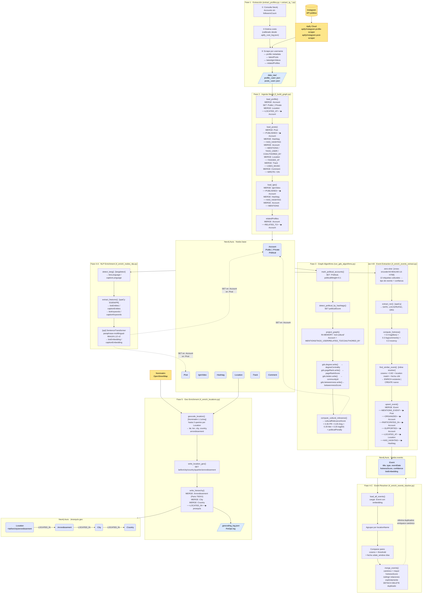

# Data Flow — Hub Cultural DU

Diagrama del flujo completo de datos, desde las fuentes externas hasta Neo4j.
Cada bloque indica el script responsable y los nodos/relaciones que crea o enriquece.

> **Cómo actualizar:** cada fase es una `subgraph` independiente. Añadir un nuevo
> script = añadir un nuevo `subgraph` y conectarlo con `-->` al storage correspondiente.

---

## Flujo completo

---

## Propiedades escritas por fase

| Fase | Nodo | Propiedades añadidas |
|------|------|----------------------|
| 2 — Ingesta | `:Account` | `id`, `fullName`, `biography`, `followersCount`, `followsCount`, `verified`, `private`, `businessCategory`, `postsCount`, `profilePicUrl` |
| 2 — Ingesta | `:Post` | `type`, `shortCode`, `url`, `caption`, `timestamp`, `likesCount`, `commentsCount`, `videoViewCount`, `displayUrl` |
| 2 — Ingesta | `:Location` | `name`, `latitude`, `longitude`, `streetAddress`, `zipCode` |
| 3 — GDS | `:Account` | `degreeCentrality`, `pageRankScore`, `communityId`, `betweennessScore`, `culturalRelevanceScore`, `politicalWeight`, `politicalScore` |
| 4-A — NLP | `:Account` | `bioLanguage`, `bioEntities`, `bioKeywords`, `bioEmbedding`\* |
| 4-A — NLP | `:Post` | `captionLanguage`, `captionEntities`, `captionKeywords`, `captionEmbedding`\* |
| 4-B — Eventos | `:Event` | `id`, `title`, `type`, `rawDate`, `eventDate`, `locationName`, `hotnessScore`, `confidence`, `postCount`, `embedding`, `createdAt` |
| 4-B — Eventos | `:Post` | `eventExtracted` (sentinel idempotencia) |
| 5 — Geo | `:Location` | `lat`, `lon`, `city`, `country`, `countryCode`, `quartier`, `arrondissement`, `displayName`, `geocodedAt` |

\* Solo con `--embeddings`

---

## Relaciones por fase

| Fase | Relación | Origen → Destino |
|------|----------|-----------------|
| 2 | `PUBLISHED` | `:Account` → `:Post` / `:IgtvVideo` |
| 2 | `HAS_HASHTAG` | `:Post` / `:IgtvVideo` → `:Hashtag` |
| 2 | `MENTIONS` | `:Post` / `:IgtvVideo` → `:Account` |
| 2 | `TAGS_USER` | `:Post` → `:Account` |
| 2 | `COAUTHORED_BY` | `:Post` → `:Account` |
| 2 | `TAGGED_AT` | `:Post` → `:Location` |
| 2 | `USES_MUSIC` | `:Post` → `:Track` |
| 2 | `WROTE` | `:Account` → `:Comment` |
| 2 | `ON` | `:Comment` → `:Post` |
| 2 | `LOCATED_AT` | `:Account` → `:Location` |
| 2 | `RELATED_TO` | `:Account` → `:Account` |
| 4-B | `MENTIONS_EVENT` | `:Post` → `:Event` |
| 4-B | `ORGANIZED` | `:Account` → `:Event` |
| 4-B | `PARTICIPATED_IN` | `:Account` → `:Event` |
| 4-B | `SUPPORTED` | `:Account` → `:Event` |
| 4-B | `LOCATED_AT` | `:Event` → `:Location` |
| 4-B | `HAS_HASHTAG` | `:Event` → `:Hashtag` |
| 5 | `LOCATED_IN` | `:Location` → `:Arrondissement` → `:City` → `:Country` |
